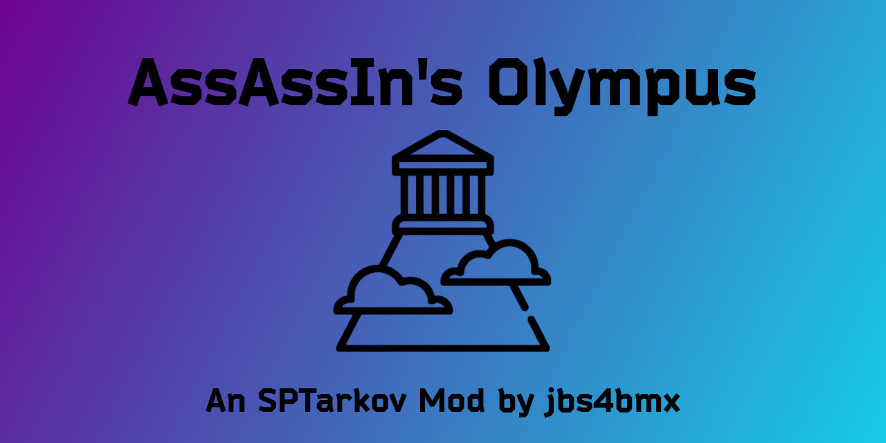

<a id="readme-top"></a>
[![Contributors][contributors-shield]][contributors-url]
[![Forks][forks-shield]][forks-url]
[![Stargazers][stars-shield]][stars-url]
[![Issues][issues-shield]][issues-url]
[![MIT License][license-shield]][license-url]

<!-- PROJECT LOGO -->
<br />
<div align="center">
  <a href="https://github.com/jbs4bmx/Olympus">
    
  </a>

  <h3 align="center">AssAssIn's Olympus</h3>

  <p align="center">The clouds above Mt. Olympus crack with a thunderous roar. Your time has come. The gods beckon you to their battle.<br /></p>

  [](https://ko-fi.com/X8X611JH15)
</div>


<!-- TABLE OF CONTENTS -->
<details>
  <summary>Table of Contents</summary>
  <ol>
    <li>
      <a href="#about-the-project">About The Project</a>
      <ul>
        <li><a href="#items-added">Items Added</a></li>
        <li><a href="#mod-variations">Mod Variations</a></li>
        <li><a href="#firearm-support">Firearm Support</a></li>
        <li><a href="#built-with">Built With</a></li>
      </ul>
    </li>
    <li>
      <a href="#getting-started">Getting Started</a>
      <ul>
        <li><a href="#prerequisites">Prerequisites</a></li>
        <li><a href="#installation">Installation</a></li>
      </ul>
    </li>
    <li>
      <a href="#configuration">Configuration</a>
      <ul>
        <li><a href="#mod-faq">Mod FAQ</a></li>
      </ul>
    </li>
    <li><a href="#roadmap">Roadmap</a></li>
    <li><a href="#contributing">Contributing</a></li>
    <li><a href="#license">License</a></li>
    <li><a href="#acknowledgments">Acknowledgments</a></li>
  </ol>
</details>


<!-- ABOUT THE PROJECT -->
## About The Project
Type: Server Mod</br>
Disclaimer: **This mod is provided _as-is_ with _no guarantee_ of support.**

>***⚡ Zeus grants you access to enhanced gear for your quests.***<br>
>***⚡ Hestia's selflessness provides you the courage and power to smite your enemies.***<br>
>***⚡ Hera, Poseidon, Demeter, Athena, Apollo, Artemis, Ares, Hephaestus, Aphrodite, Hermes, and Dionysus rally you on as you storm into battle.***

This is a re-worked version of AssAssIn's Olympus mod for SPT. This mod adds rigs, armor, a helmet, a backpack, stimulants, and magazines with OP properties. The items are all sold by Therapist, Ragman, or Jaeger depending on what type of item they are.

### Items Added
**Apollo's Magazines (62 in total):**
  - Configurable capacity.
  - OP Accuracy.
  - OP Ergonomics.
  - Reduced Recoil.
  - Reduced Loudness.
  - Reduced Malfunction chance.
  - Reduced Check time.
  - Slightly increased examine and loot experience.
  - Greatly reduced item weight.

**Apollo's Stim/Propital/Pain/CMS Stimulants:**
  - OP stats boost depending on stimulant used.
  - OP pain relief or damage repair depending on stimulant used.
  - No negative side affects from usage.
  - 360 seconds of positive effects from each usage.
  - Configurable uses per Stimulant.

**Armor Of Athena:**
  - Full body armor protecting the chest/back/sides/upper arms/stomach.
  - Configurable armor protection.
  - Class 10 Armor. (The highest available.)

**Atlas' Satchel:**
  - An incredibly spacious bag to hold the spoils of battle.
  - It may look small, but it's bigger on the inside.
  - Configurable sizes

**Hercules' Rig v1/Rig v2:**
  - Grants the wearer immense strength to carry more spoils from their battle. (aka. Greatly decreased item weight.)
  - Rig v2 is also an armored rig for those more intense battles.

**Helmet Of Hermes:**
  - Full protection of the Head (top/back/ears/eyes/jaws).
  - Class 10 Armor. (The highest available.)

<p align="right">(<a href="#readme-top">back to top</a>)</p>

### Mod Variations
**Full Version**</br>
This the full implementation of the mod and includes many new items to enhance your raids. If enabled, this version will ignore the other 3 options listed below.
  - 4 new Stims offered by Therapist
    - Apollo's Pain -- Ultimate pain relief.
    - Apollo's Stim -- The most OP Buffs ever?
    - Apollo's Propital -- Cures ailments such as bleeding, diseases, and fractures. Also provides energy and hydration.
    - Apollo's CMS -- Fixes blackened limbs
  - 5 new Gear items offered by Ragman
    - Hercules' Rig (Standard Rig)
    - Hercules' Rig 2 (Armored Rig)
    - Helmet of Hermes
    - Armor of Athena
    - Atlas' Satchel
  - 62 new Magazine options offered by Jaeger
    - 250rd mags for 116 supported firearms with OP buffs. (Cartridge count can be edited in the config file.)

_NOTE: Any combination of the following 3 options can be enabled. Remember to set FullVersion to false._

**Mags Only Version**</br>
Only the full amount of new magazines from the mod are loaded.
  - 62 new Magazine options offered by Jaeger

**Rigs Only Version**</br>
Only the rigs from the mod are loaded.
  - 5 new Gear items offered by Ragman

**Stims Only Version**</br>
Only the stimulants from the mod are loaded.
  - 4 new Stims offered by Therapist

<p align="right">(<a href="#readme-top">back to top</a>)</p>

### Firearm Support
There is no support for stationary, revolvers, grenade launchers, or single-shot firearms.</br>
| Firearm | Status |   | Firearm | Status |   | Firearm | Status |   | Firearm | Status |
| ---: | :--- | --- | ---: | :--- | --- | ---: | :--- | --- | ---: | :--- |
| ADAR 2-15 | ✅**Supported** |   | AGS-30 | ❌ Unsupported |   | AK-101 | ✅**Supported** |   | AK-102 | ✅**Supported** |
| AK-103 | ✅**Supported** |   | AK-104 | ✅**Supported** |   | AK-105 | ✅**Supported** |   | AK-12 | ✅**Supported** |
| AK-74 | ✅**Supported** |   | AK-74M | ✅**Supported** |   | AK-74N | ✅**Supported** |   | AKM | ✅**Supported** |
| AKMN | ✅**Supported** |   | AKMS | ✅**Supported** |   | AKMSN | ✅**Supported** |   | AKS-74 | ✅**Supported** |
| AKS-74N | ✅**Supported** |   | AKS-74U | ✅**Supported** |   | AKS-74UB | ✅**Supported** |   | AKS-74UN | ✅**Supported** |
| APB | ✅**Supported** |   | APS | ✅**Supported** |   | AS VAL | ✅**Supported** |   | ASh-12 | ✅**Supported** |
| AUG A1 | ✅**Supported** |   | AUG A3 | ✅**Supported** |   | AVT-40 | ✅**Supported** |   | AXMC | ✅**Supported** |
| CR 200DS | ❌ Unsupported |   | CR 50DS | ❌ Unsupported |   | DT MDR 5.56x45 | ✅**Supported** |   | DT MDR 7.62x51 | ✅**Supported** |
| DVL-10 | ✅**Supported** |   | FN 5-7 | ✅**Supported** |   | FN 5-7 (FDE) | ✅**Supported** |   | FN40GL | ❌ Unsupported |
| Glock 17 | ✅**Supported** |   | Glock 18C | ✅**Supported** |   | Glock 19X | ✅**Supported** |   | HK 416A5 | ✅**Supported** |
| HK G28 | ✅**Supported** |   | HK G36 | ✅**Supported** |   | KS-23M | ✅**Supported** |   | M1911A1 | ✅**Supported** |
| M1A | ✅**Supported** |   | M3 Super 90 | ✅**Supported** |   | M32A1 | ❌ Unsupported |   | M45A1 | ✅**Supported** |
| M4A1 | ✅**Supported** |   | M590A1 | ✅**Supported** |   | M700 | ✅**Supported** |   | M870 | ✅**Supported** |
| M9A3 | ✅**Supported** |   | MCX | ✅**Supported** |   | Mk-18 | ✅**Supported** |   | Mk47 | ✅**Supported** |
| Mosin (Infantry) | ✅**Supported** |   | Mosin (Sniper) | ✅**Supported** |   | MP-133 | ✅**Supported** |   | MP-153 | ✅**Supported** |
| MP-155 | ✅**Supported** |   | MP-18 | ❌ Unsupported |   | MP-43 sawed-off | ❌ Unsupported |   | MP-43-1C | ❌ Unsupported |
| MP-443 "Grach" | ✅**Supported** |   | MP5 | ✅**Supported** |   | MP5K-N | ✅**Supported** |   | MP7A1 | ✅**Supported** |
| MP7A2 | ✅**Supported** |   | MP9 | ✅**Supported** |   | MP9-N | ✅**Supported** |   | MPX | ✅**Supported** |
| MTs-255-12 | ❌ Unsupported |   | NSV "Utyos" | ❌ Unsupported |   | OP-SKS | ✅**Supported** |   | P226R | ✅**Supported** |
| P90 | ✅**Supported** |   | PB pistol | ✅**Supported** |   | PKM | ✅**Supported** |   | PKP | ✅**Supported** |
| PL-15 | ✅**Supported** |   | PM pistol | ✅**Supported** |   | PM(t) pistol | ✅**Supported** |   | PP-19-01 Vityaz-SN | ✅**Supported** |
| PP-9 "Klin" | ✅**Supported** |   | PP-91 "Kedr" | ✅**Supported** |   | PP-91-01 "Kedr-B" | ✅**Supported** |   | PPSh-41 | ✅**Supported** |
| RD-704 | ✅**Supported** |   | RFB | ✅**Supported** |   | RPK-16 | ✅**Supported** |   | RSASS | ✅**Supported** |
| RSh-12 | ❌ Unsupported |   | SA-58 | ✅**Supported** |   | SAG AK | ✅**Supported** |   | SAG AK Short | ✅**Supported** |
| Saiga-12 | ✅**Supported** |   | Saiga-9 | ✅**Supported** |   | SCAR-H | ✅**Supported** |   | SCAR-H (FDE) | ✅**Supported** |
| SCAR-L | ✅**Supported** |   | SKS | ✅**Supported** |   | SP-81 | ❌ Unsupported |   | SR-1MP Gyurza, | ✅**Supported** |
| SR-25 | ✅**Supported** |   | SR-2M | ✅**Supported** |   | STM-9 | ✅**Supported** |   | SV-98 | ✅**Supported** |
| SVDS | ✅**Supported** |   | SVT-40 | ✅**Supported** |   | T-5000 | ✅**Supported** |   | TOZ-106 | ✅**Supported** |
| TT pistol (gold) | ✅**Supported** |   | TT pistol | ✅**Supported** |   | TX-15 DML | ✅**Supported** |   | UMP 45 | ✅**Supported** |
| USP .45 | ✅**Supported** |   | Vector .45 | ✅**Supported** |   | Vector 9x19 | ✅**Supported** |   | VPO-101 | ✅**Supported** |
| VPO-136 | ✅**Supported** |   | VPO-209 | ✅**Supported** |   | VPO-215 | ✅**Supported** |   | VSS Vintorez | ✅**Supported** |
| 9A-91 | ✅**Supported** |   | VSK-94 | ✅**Supported** |   | RPD | ✅**Supported**|   | RPDN | ✅**Supported** |
| MCX Spear | ✅**Supported** |   | Blicky | ✅**Supported** |   |   |   |   |   |   |

<p align="right">(<a href="#readme-top">back to top</a>)</p>

### Built With
| Frameworks/Libraries                                      | Name         | Link                                       |
| :-------------------------------------------------------: | :----------: | :----------------------------------------: |
|       | `TypeScript` | [TypeScript Website][TypeScript-url]       |

|                         IDEs                                |      Name       | Link                                      |
| :---------------------------------------------------------: | :-------------: | :---------------------------------------: |
|      | `VSCodium`      | [VSCodium Website][Vscodium-url]          |

<p align="right">(<a href="#readme-top">back to top</a>)</p>


<!-- GETTING STARTED -->
## Getting Started
This section will explain how to install and use this mod.

### Prerequisites
EFT and SPT are required to use this mod.

### Installation
_For the purpose of these directions, "[SPT]" represents your SPT folder path._

Start by downloading the mod from the [Releases](https://github.com/jbs4bmx/Olympus/releases) page.

Follow these steps to install and configure the mod:
  1. Extract the contents of the zip file into the root of your [SPT] folder.
     - That's the same location as "SPT.Server.exe" and "SPT.Launcher.exe".
  2. Edit the Config to adjust the values to your liking.
  3. Start SPT.Server.exe and wait until it fully loads.
  4. Start SPT.Launcher.exe.
  5. Now you can launch the game and profit.

<p align="right">(<a href="#readme-top">back to top</a>)</p>


<!-- CONFIGURATION EXAMPLES -->
## Configuration
Although you can run it default, there are configuration options to tweak it a bit. Edit the corresponding option(s) in the configuration file to make the mod work in the way that you want it to. By default, the entire database of this mod is loaded, but you can also limit it to one of the 3 categories, or a combination of the 3.

For example: If you only want to use the stimulants and the magazines from this mod, then change "FullVersion" to false and change "MagOnly" and "StimsOnly" to true.

``` jsonc
{
  // ====================================================================================================
  // VERSION_SELECTION
  // Choose 1 or more options.
  // Determines the version of the mod to load. (Default = FullVersion)
  // NOTE 1: If FullVersion is set to "true", the other 3 options will be ignored.
  // NOTE 2: Set FullVersion to false if using the any of the other 3 options.
  // ====================================================================================================
  "FullVersion": true,
  "MagsOnly": false,
  "RigsOnly": false,
  "StimsOnly": false,


  // ====================================================================================================
  // RIG_OPTIONS
  // Settings are ignored if rigs are disabled.
  // ====================================================================================================
  "athenaArmorAmount": 10000,
  "herculesRig2ArmorAmount": 10000,
  "helmetofhermesArmorAmount": 10000,
  // Maximum recommended values based on screen size for following options:
  // 1080p -> [24h x 14v], 1440p -> [32h x 16v], 4K -> [40h? x 20v?] (4K is currently untested)
  "atlassatchelHorizontal": 24,
  "atlassatchelVertical": 14,


  // ====================================================================================================
  // STIM_OPTIONS
  // Settings are ignored if stims are disabled.
  // ====================================================================================================
  "numberOfStimUses": 4,
  "stimUseTimeInSeconds": 3,


  // ====================================================================================================
  // BLACKLISTING
  // Choose 1 or more options.
  // Setting this value to true will stop bots from generating with Olympus items in their inventory.
  // ====================================================================================================
  "blacklistStims": false,
  "blacklistRigs": false,
  "blacklistMags": false
}
```

<p align="right">(<a href="#readme-top">back to top</a>)</p>

### Mod FAQ
**Q: Where do I report bugs found with the current version of the mod?** <br>
A: You can report bugs for the current version of this mod on the [AO Mod Forum Page](https://hub.sp-tarkov.com/forum/thread/2008-olympus/).

<p align="right">(<a href="#readme-top">back to top</a>)</p>


<!-- ROADMAP -->
## Roadmap
- [ ] Add new trader for selling of custom items.
- [ ] Add custom trader avatar for new trader.
- [ ] Add alternative trader avatar for use with trader image switching mods.
- [ ] Add new questline for advancement with new trader.
- [ ] Add even more variations of magazines with different properties based on item levels.
- [ ] Update code for SPT Server v4.0.0 (New server is written in C#)

Suggest changes [here](https://github.com/jbs4bmx/Olympus/issues).
Report issues [here](https://hub.sp-tarkov.com/forum/thread/2008-olympus/).

<p align="right">(<a href="#readme-top">back to top</a>)</p>


<!-- CONTRIBUTING -->
## Contributing
Contributions are what make the open source community such an amazing place to learn, inspire, and create. Any contributions you make are **greatly appreciated**.

If you have a suggestion that would make this better, please fork the repo and create a pull request. You can also simply open an issue with the tag "enhancement".
Don't forget to give the project a star! Thanks again!

1. Fork the Project
2. Create your Feature Branch (`git checkout -b feature/AmazingFeature`)
3. Commit your Changes (`git commit -m 'Add some AmazingFeature'`)
4. Push to the Branch (`git push origin feature/AmazingFeature`)
5. Open a Pull Request

You can also buy me a coffee! (This is not required, but I greatly appreciate any support provided.)</br>
[](https://ko-fi.com/X8X611JH15)

<p align="right">(<a href="#readme-top">back to top</a>)</p>


<!-- LICENSE -->
## License
Distributed under the MIT License. See `LICENSE.txt` for more information.

<p align="right">(<a href="#readme-top">back to top</a>)</p>


<!-- ACKNOWLEDGMENTS -->
## Acknowledgments
Contributors:</br>
None yet.

<p align="right">(<a href="#readme-top">back to top</a>)</p>


<!-- Repository Metrics -->
[contributors-shield]: https://img.shields.io/github/contributors/jbs4bmx/Olympus.svg?style=for-the-badge
[contributors-url]: https://github.com/jbs4bmx/Olympus/graphs/contributors
[forks-shield]: https://img.shields.io/github/forks/jbs4bmx/Olympus.svg?style=for-the-badge
[forks-url]: https://github.com/jbs4bmx/Olympus/network/members
[stars-shield]: https://img.shields.io/github/stars/jbs4bmx/Olympus.svg?style=for-the-badge
[stars-url]: https://github.com/jbs4bmx/Olympus/stargazers
[issues-shield]: https://img.shields.io/github/issues/jbs4bmx/Olympus.svg?style=for-the-badge
[issues-url]: https://github.com/jbs4bmx/Olympus/issues
[license-shield]: https://img.shields.io/github/license/jbs4bmx/Olympus.svg?style=for-the-badge
[license-url]: https://github.com/jbs4bmx/Olympus/blob/master/LICENSE.txt


<!-- Framwork/Library URLs -->
[TypeScript-url]: https://www.typescriptlang.org/
[Vscodium-url]: https://vscodium.com/
